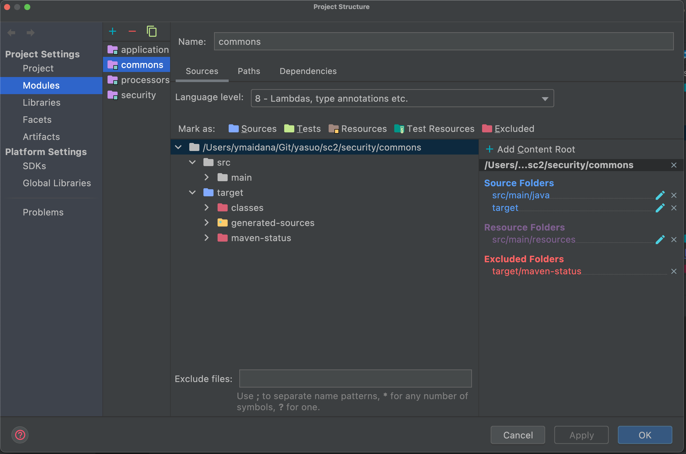

# SpringSecurity part 1
This is a Spring Security practice repository. It is based on this YouTube video https://www.youtube.com/watch?v=her_7pa0vrg&amp;list=WL&amp;index=98&amp;t=1040s

## Changing github credentials
To set GitHub credentials for first time run
``git config credential.helper store``
- You can configure global credentials using ``git config --global credential.helper store``
- You can ensure that you are configuring local credentials using ``git config --local credential.helper store``
To change GitHub credentials we will need first to unset the credential helper.
To do it, run this command 
``git config --global --unset credential.helper`` 
You can choose between global and local changing ``--global`` to ``--local``

## Configuring debugging mode
To enable debugging using the IntelliJD IDE, you should run

``spring-boot:run -Dspring-boot.run.fork=false``

To understand how this runs, check this [link](https://stackoverflow.com/questions/44096708/how-to-debug-spring-boot-application-with-intellij-idea-community-edition)

## Solving packaging problems

If you don't have a main class in spring-boot project, you can execute spring-boot-maven-plugin by follow

[See the reference](https://stackoverflow.com/a/56535517)

``` xml
<build>
    <plugins>
        <plugin>
            <groupId>org.springframework.boot</groupId>
            <artifactId>spring-boot-maven-plugin</artifactId>
            <configuration>
                <skip>true</skip>
            </configuration>
        </plugin>
    </plugins>
</build>
```

## Solving generating code from annotations 

Read [this](https://stackoverflow.com/questions/31345893/debug-java-annotation-processors-using-intellij-and-maven) stack overflow answer.

Additionally, look [blog entry](http://hannesdorfmann.com/annotation-processing/annotationprocessing101/)

## How to debug a processor

Check this blog [entry](http://blog.jensdriller.com/how-to-debug-a-java-annotation-processor-using-intellij/) 
here it teaches you how to debug using IntelliJ

After completing the tutorial, remember to run this command ``mvnDebug clean install`` just before debugging

## Solving not recognizing generated files
IntelliJ was marking all subdir of my generated-sources/cxf folder as source roots... So a simple highlight of all folders and un-mark as sources fixes the issue. [Link](https://stackoverflow.com/questions/45143135/intellij-idea-cannot-see-generated-sources-directory)


## Changing user and username
To see which git configuration you are using, type this `git config --list` in console
To change user and email type `git config user.name "<your username>` and `git config user.email "<your mail>"`


# SpringSecurity part 2

This part is based on this [YouTube video](https://www.youtube.com/watch?v=VVn9OG9nfH0&list=WL&index=90)